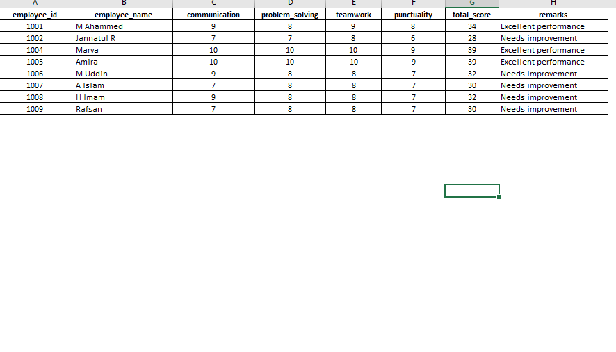
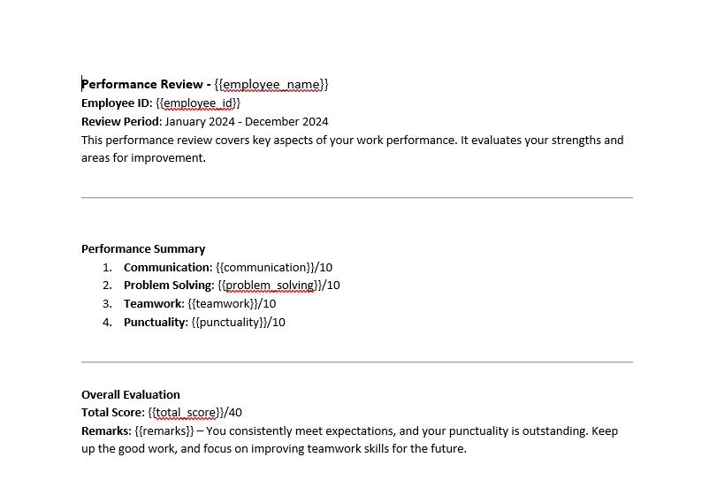

# Marks Data to Word Document Generator

This project automates the generation of mark sheets from an Excel file. It reads student data from an Excel spreadsheet and creates individual Word documents for each student using a template.

## Features

- Reads data from an Excel file containing student marks.
- Generates personalized mark sheets in Word format for each student.
- Uses `openpyxl` to handle Excel files and `docxtpl` to create Word documents.

## Requirements

- Python 3.x
- `openpyxl` library
- `docxtpl` library
- An Excel file named `marks_data.xlsx` with student marks
- A Word document template named `mark-sheet.docx`

## Installation
1. Clone this repository:

   `git clone https://github.com/mcseiu05/excel-word.git`
   

2. Navigate to the project directory:

   `cd excel-word`

3. Install the required libraries:

   `pip install openpyxl docxtpl`

## Usage

- Prepare your Excel file (performance_summary.xlsx) with the following structure:

   

- Create a Word template (mark-sheet.docx) with placeholders for the data:

  

- Run the script:

   py main.py

The generated Word documents will be saved in the same directory with names formatted as mark-sheet[Role].docx.

## Contributing

Feel free to submit issues or pull requests if you have suggestions or improvements.
